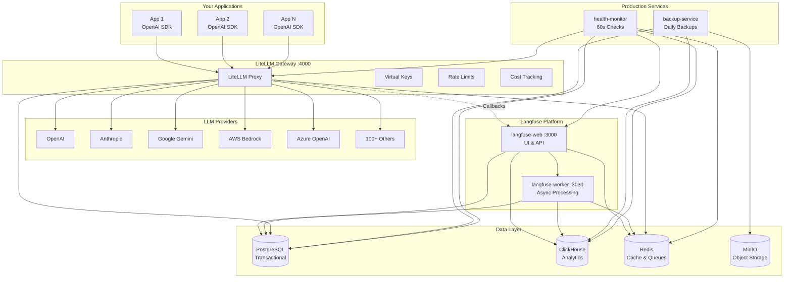
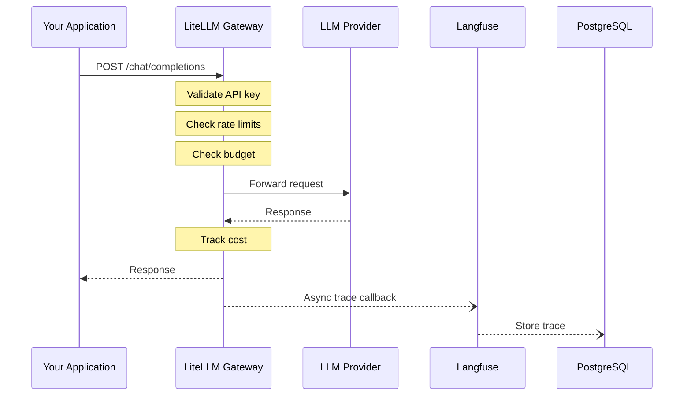

# Architecture

This document provides an overview of the LiteLLM + Langfuse Railway deployment architecture.

## High-Level Overview



## Request Flow



## Service Details

### Core Services (Both Templates)

| Service | Image | Port | Purpose |
|---------|-------|------|---------|
| litellm | `ghcr.io/berriai/litellm-database:main-stable` | 4000 | Unified LLM gateway with virtual keys and cost tracking |
| langfuse-web | `langfuse/langfuse:3` | 3000 | Observability UI, API, prompt management |
| langfuse-worker | `langfuse/langfuse-worker:3` | 3030 | Async trace processing, evaluations |
| postgres | `ghcr.io/railwayapp-templates/postgres-ssl:16` | 5432 | Transactional data (users, keys, configs) |
| clickhouse | `clickhouse/clickhouse-server:24` | 8123 | Analytics data (traces, scores, metrics) |
| redis | `bitnami/redis:7.2` | 6379 | Caching, rate limiting, queues |
| minio | `minio/minio` | 9000 | S3-compatible object storage |

### Production-Only Services

| Service | Purpose |
|---------|---------|
| backup-service | Daily automated backups of PostgreSQL and ClickHouse to MinIO |
| health-monitor | 60-second health checks with Slack/Discord/PagerDuty alerting |

## Network Topology

All services communicate over Railway's private network using `.railway.internal` DNS:

```
litellm.railway.internal:4000
langfuse-web.railway.internal:3000
langfuse-worker.railway.internal:3030
postgres.railway.internal:5432
clickhouse.railway.internal:8123
redis.railway.internal:6379
minio.railway.internal:9000
```

Only `litellm` and `langfuse-web` are exposed publicly via Railway domains.

## Data Flow

### Traces
1. Application calls LiteLLM
2. LiteLLM forwards to provider, receives response
3. LiteLLM sends trace to Langfuse via callback
4. Langfuse-web receives trace, queues for processing
5. Langfuse-worker processes trace asynchronously
6. Trace stored in ClickHouse for analytics

### Virtual Keys & Budgets
1. Admin creates virtual key via LiteLLM UI/API
2. Key stored in PostgreSQL with budget/rate limits
3. Each request validates key and updates spend
4. Budget exceeded = request rejected

### Backups (Production)
1. Backup service runs on schedule (daily by default)
2. PostgreSQL: `pg_dump` to MinIO
3. ClickHouse: Native backup to MinIO
4. Retention: Configurable (default 7 days)

## Security Considerations

- **Network Isolation**: Services communicate only via private network
- **Secret Management**: Credentials passed via Railway environment variables
- **Immutable Salt**: `LITELLM_SALT_KEY` cannot be changed after initial deployment
- **API Key Format**: `LITELLM_MASTER_KEY` must start with `sk-`

See [SECURITY.md](../SECURITY.md) for vulnerability reporting.
